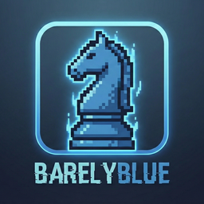

<div align="center">
  

  # BarelyBlue Chess Engine

  **A UCI-compliant chess engine with classical evaluation and minimax search**

  [](https://www.python.org/downloads/)
  [](https://opensource.org/licenses/MIT)

</div>

A chess engine built with classical evaluation and search algorithms, designed for future neural network integration.

## Overview

BarelyBlue is a UCI-compliant chess engine implementing:
- **Classical Evaluation**: Piece-Square Tables (PST) for position assessment
- **Minimax Search**: Alpha-beta pruning for efficient move searching
- **Transposition Table**: Zobrist hashing for position caching
- **UCI Protocol**: Compatible with chess GUIs (Arena, CuteChess, etc.)

This is Phase 1 of a multi-phase project that will eventually integrate neural network evaluation.

## Project Structure

```
chess_engine/
├── board/              # Board representation (tensor conversion)
├── evaluation/         # Position evaluation (classical and future neural)
├── search/             # Search algorithms (minimax, alpha-beta, transposition table)
├── uci/                # UCI protocol implementation
└── utils/              # Testing utilities (Bratko-Kopec, etc.)

notebooks/              # Jupyter notebooks for visualization
tests/                  # Unit tests
docs/                   # Documentation and roadmap
```

## Installation

### Prerequisites
- Python 3.9+
- pip

### Setup

1. Clone the repository:
```bash
git clone https://github.com/yourusername/BarelyBlue.git
cd BarelyBlue
```

2. Install dependencies:
```bash
pip install -r requirements.txt
```

3. Verify installation:
```bash
python -c "import chess_engine; print('Installation successful!')"
```

## Usage

### Running the Engine (UCI Mode)

#### Quick Start (Recommended)
```bash
./barelyblue-engine
```

Then interact via UCI commands:
```
uci
isready
position startpos moves e2e4
go depth 5
quit
```

#### Alternative (Python Module)
```bash
python -m chess_engine.uci
```

### Using with Chess GUIs

#### En-croissant (Recommended - Modern Web-Based)
1. Download [En-croissant](https://encroissant.org/)
2. Go to **Engines** → **Add Engine** → **Local**
3. **Binary file**: Select `barelyblue-engine` from the project directory
4. **Name**: Auto-detects as "BarelyBlue 1.0" (or customize)
5. **Image file** (optional): Select `assets/barelyblue-icon-60.png`
6. Click **Add** and start playing!

#### Arena (Windows)
1. Download Arena from [arena-chess.com](http://www.playwitharena.de/)
2. Add engine: `Engines` → `Install New Engine`
3. Select: `barelyblue-engine` (or use `python -m chess_engine.uci`)
4. Play against the engine

#### CuteChess (Cross-platform)
1. Install CuteChess: `brew install cutechess` (macOS) or download from [cutechess.com](https://cutechess.com/)
2. Add engine: `Tools` → `Settings` → `Engines` → `Add`
3. Command: `/full/path/to/barelyblue-engine`
4. Working directory: Project root

### Interactive Analysis (Jupyter)

```bash
jupyter notebook notebooks/board_visualization.ipynb
```

This provides:
- Board visualization
- Position analysis
- Engine vs. engine games
- Evaluation plots
- Bratko-Kopec test suite

### Generating Training Datasets (Phase 2)

Generate training data from Lichess PGN files for neural network training:

```bash
# Install Stockfish (required for evaluation)
brew install stockfish  # macOS
# or: apt install stockfish  # Linux

# Generate dataset from PGN file
python tools/generate_dataset.py generate \
    --pgn data/lichess_elite.pgn \
    --output data/training.h5 \
    --max-positions 100000 \
    --stockfish-depth 15 \
    --min-elo 2000

# Validate existing dataset
python tools/generate_dataset.py validate \
    data/training.h5 \
    --output-report data/validation_report.md
```

**Dataset Format**: HDF5 with 18-channel tensors (12 piece planes + 6 metadata planes) and Stockfish evaluations at depth 15.

**Features**:
- Automatic train/validation/test splits (80/10/10)
- Position deduplication using Zobrist hashing
- Quality filtering (ELO, ply range, piece count)
- Batch processing with progress tracking
- Comprehensive validation reports

### Running Tests

```bash
# Run all tests
pytest tests/

# Run specific test file
pytest tests/test_evaluation.py

# Run with coverage
pytest tests/ --cov=chess_engine --cov-report=html

# View coverage report
open htmlcov/index.html
```

## Performance Targets (Phase 1)

### Search Speed
- **Depth 4**: ~0.1-0.5 seconds
- **Depth 5**: ~1-3 seconds
- **Depth 6**: ~5-15 seconds (with transposition table)

### Tactical Strength
- **Bratko-Kopec**: ≥8/24 at depth 5 (reasonable classical engine)
- **Mate-in-1**: 100% detection
- **Mate-in-2**: High detection rate at depth 4+

## Development Roadmap

### Phase 1: Classical Engine ✅ COMPLETE
- ✅ Board representation with tensor conversion
- ✅ Classical PST evaluation
- ✅ Minimax + alpha-beta pruning
- ✅ Transposition table
- ✅ UCI protocol
- ✅ Bratko-Kopec testing

### Phase 2: Neural Network Data Pipeline ✅ COMPLETE
- ✅ PGN parser for Lichess databases
- ✅ Position extraction with quality filtering
- ✅ 18-channel tensor representation with metadata
- ✅ Stockfish integration for ground truth labels
- ✅ HDF5 dataset writer with train/val/test splits
- ✅ Dataset validator with quality checks
- ✅ End-to-end pipeline orchestration
- ✅ CLI tool for dataset generation

### Phase 3: Neural Network Training (Next)
- ResNet architecture (5-10 blocks)
- Training pipeline with PyTorch
- Model evaluation and validation
- Hybrid classical/neural evaluation
- Comparison benchmarks

### Phase 4: Advanced Search (Future)
- Quiescence search
- Iterative deepening
- Null move pruning
- Late move reductions
- Killer moves heuristic
- History heuristic
- Enhanced time management

### Phase 4: Refinement (Future)
- Opening book
- Endgame tablebases
- Parallel search (multi-threading)
- ELO estimation
- Tournament testing

## Architecture

### Modular Design

```
┌─────────────┐
│  UCI Input  │
└──────┬──────┘
       │
       ↓
┌─────────────┐
│   Engine    │ ← Coordinates search & evaluation
└──────┬──────┘
       │
       ├─────→ ┌──────────────┐
       │       │    Search    │ ← Minimax + Alpha-Beta
       │       └──────┬───────┘
       │              │
       │              ├─────→ ┌───────────────────┐
       │              │       │ Transposition TT  │ ← Position cache
       │              │       └───────────────────┘
       │              │
       │              └─────→ ┌──────────────┐
       │                      │  Evaluator   │ ← Swappable!
       │                      └──────────────┘
       │                             ↓
       │                      ┌─────────────┐
       │                      │  Classical  │ (Phase 1)
       │                      └─────────────┘
       │                             OR
       │                      ┌─────────────┐
       │                      │   Neural    │ (Phase 3+)
       │                      └─────────────┘
       │
       └─────→ ┌──────────────┐
               │  UCI Output  │
               └──────────────┘
```

**Key Design Principle**: The `Evaluator` interface is **swappable**. The search algorithm doesn't care whether evaluation comes from classical PST or a neural network. This enables seamless transition from Phase 1 → Phase 3.

## Testing

### Unit Tests

- `test_evaluation.py`: Evaluation correctness
- `test_search.py`: Search algorithm correctness
- `test_uci.py`: UCI protocol compliance

### Integration Tests

- Bratko-Kopec test suite: Tactical positions
- Win At Chess (WAC): Extended tactical tests
- Engine vs. engine games

### Test Coverage Goal

80%+ coverage for core modules in Phase 1.

## Contributing

This is a personal learning project, but suggestions are welcome!

1. Fork the repository
2. Create a feature branch (`git checkout -b feature/amazing-feature`)
3. Commit your changes (`git commit -m 'Add amazing feature'`)
4. Push to the branch (`git push origin feature/amazing-feature`)
5. Open a Pull Request

## Resources

### Documentation
- [Chess Programming Wiki](https://www.chessprogramming.org/) - Comprehensive chess engine reference
- [python-chess docs](https://python-chess.readthedocs.io/) - Python chess library documentation
- [UCI Protocol](https://www.chessprogramming.org/UCI) - Universal Chess Interface specification

### Referenced Materials
- **Simplified Evaluation Function**: https://www.chessprogramming.org/Simplified_Evaluation_Function
- **Minimax Algorithm**: https://www.chessprogramming.org/Minimax
- **Alpha-Beta Pruning**: https://www.chessprogramming.org/Alpha-Beta
- **Zobrist Hashing**: https://www.chessprogramming.org/Zobrist_Hashing
- **Bratko-Kopec Test**: https://www.chessprogramming.org/Bratko-Kopec_Test

### Books
- *"Building a Chess Engine with ML"* (included in project docs)

## License

MIT License - See LICENSE file for details

## Author

**Alix Muller**

Built as a learning project to explore classical chess programming and prepare for neural network integration.

## Acknowledgments

- Chess Programming Wiki community
- python-chess library maintainers
- Stockfish team (for evaluation reference)
- Danny Kopec and Ivan Bratko (Bratko-Kopec test suite)

## Changelog

### Version 2.0 (Phase 2) - Current
- ✅ Complete data pipeline for neural network training
- ✅ PGN parser with ELO filtering
- ✅ Position extractor with quality filters
- ✅ 18-channel tensor representation
- ✅ Stockfish integration for ground truth labels
- ✅ HDF5 dataset writer with compression
- ✅ Dataset validator with quality checks
- ✅ CLI tool for dataset generation
- ✅ 109 passing tests, comprehensive test coverage

### Version 1.0 (Phase 1) - Complete
- ✅ Classical evaluation with piece-square tables
- ✅ Minimax search with alpha-beta pruning
- ✅ Transposition table with Zobrist hashing
- ✅ UCI protocol implementation
- ✅ Bratko-Kopec test suite
- ✅ Jupyter notebook visualization

### Planned for Version 3.0 (Phase 3)
- Neural network architecture (ResNet)
- Training pipeline with PyTorch
- Model evaluation framework
- Hybrid classical/neural evaluation mode

---

**Status**: Phase 2 Complete - Data Pipeline Ready
**Next Steps**: Phase 3 - Neural Network Training
